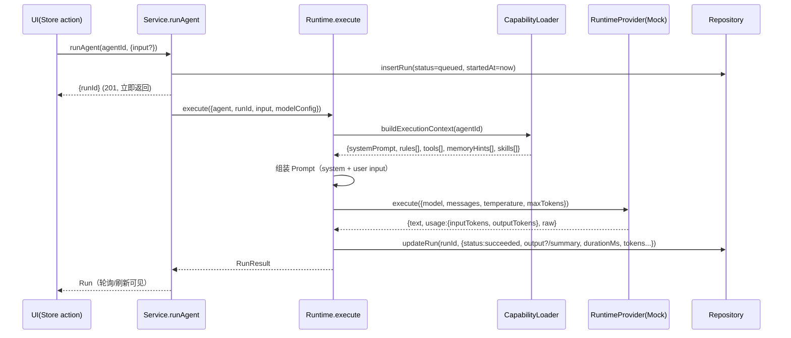
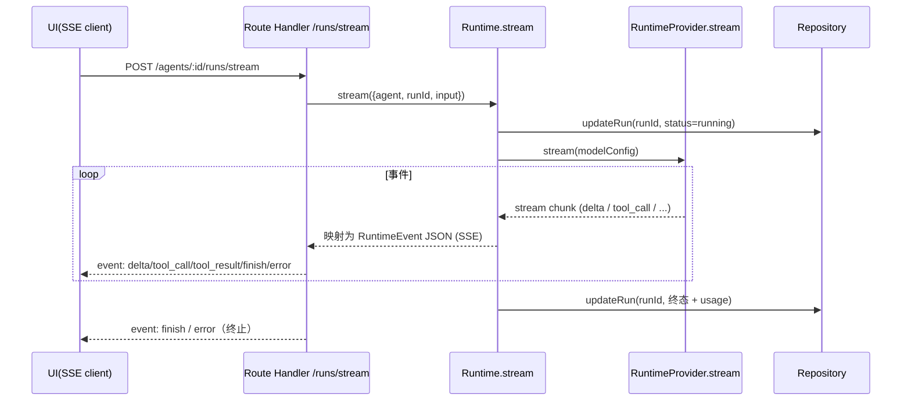

# P5-1 AI Runtime Architecture & Contract

> 项目：AI Workspace · Phase 5 第一阶段（纯设计，零代码修改）
> 日期：2026-09-08 · 状态：待审批
> 关联：`P4-1 Backend Architecture & API Design`（数据层契约）、`P4-2 Real Backend 实施`、`P4-3 统计端点化收尾`、`P4-4 交付增强 & V1 RC`
> 范围：把「Agent → runAgent 演示桩 → Run」设计为「Agent → Runtime → Model / Prompt / Context / Capability / Execution → Run」；**本阶段不接真实 LLM、不实现 Provider Adapter / Streaming / Tool Runtime / Memory Retrieval**

---

## 一、背景与目标

### 1.1 现状（V1 RC）

```
UI（触发"运行 Agent"）
  → POST /api/v1/agents/:id/runs
  → db/service.ts: runAgent(agentId)
      ├─ 读取 Agent（存在性校验）
      ├─ 随机 86% 成功 / 8s~230s 时长 / 900~38k tokens
      ├─ 插入 agent_run（status: success|failed + summary + durationMs + tokensUsed + messages）
      └─ 更新 agent.lastRunAt
```

现状约束：
- `agent_run` 表字段：id / agent_id / status / summary / duration_ms / tokens_used / messages / started_at / finished_at
- `RunStatus`（前端 Domain）：`"success" | "failed" | "running"`（`running` 存在但未使用）
- `AgentRunDTO.status` 为宽松 `string`
- `ModelId`（前端选型）：`doubao-pro | doubao-lite | gpt-4o | claude-sonnet`
- 统计（Dashboard / Project / Agent）全部派生自 `agent_run`（P4-3 端点化完成），**统计契约不允许因 Runtime 引入而改变**

### 1.2 目标架构（P5 完成态）

```
Agent ──装配── CapabilityDefinition（资产层）
  │            ↑ AgentCapability（关系层，enabled / 三态）
  │
  ├──▶ Service.runAgent(request)          [业务规则：校验 Agent、装配可见性、Run 生命周期]
  │         │
  │         ▼
  │    Runtime.execute(request)           [编排层：构建 Prompt/Context → 调度 Provider → 事件流 → 结果落库]
  │         │
  │         ▼
  │    RuntimeProvider (Adapter 接口)     [统一接口；OpenAI/DeepSeek/Anthropic 未来注册为 Adapter]
  │         │
  │         ▼
  │    [未来] 真实 LLM API                 [本阶段不实现]
  │
  └──▶ agent_run 落库（Run 生命周期状态机）→ 统计 / 明细（UI 零重设计）
```

### 1.3 设计原则

1. **Provider 无关**：Runtime 编排层只依赖抽象接口，任何 Provider 细节不得泄漏到 Service / Store / UI。
2. **Capability 资产化不变式**：`CapabilityDefinition`（资产）与 `AgentCapability`（装配）两层模型保持；Runtime 是**消费者**，不改变资产/装配的写路径。
3. **Mock / Real 双模式保留**：`Runtime` 提供双实现（mock / real），UI / Dashboard / Project / Run 数据模型与统计口径零重设计；Mock 是回滚与离线演示通道。
4. **Run 是唯一事实记录**：执行过程的一切可观测结果最终沉淀为 `agent_run` 的一行；事件流是传输态，不成为第二数据源。
5. **小步演进**：P5-2 只落地"编排层 + 状态机 + 契约"，真实 LLM 接入前所有代码均可离线运行。

---

## 二、Runtime 架构图

```
┌─────────────────────────────── UI 层 ───────────────────────────────┐
│  Agents 详情 · Run 历史 · Dashboard / Project 统计（只读派生）        │
│  [未来] Run Detail / Streaming 面板                                  │
└──────────────┬──────────────────────────────────────────────────────┘
               │ 同名函数契约（lib/services/agents.ts → runAgent）
┌──────────────▼──────────────────────────────────────────────────────┐
│  Service 层（db/service.ts）                                         │
│  runAgent(agentId, input?)                                          │
│   ├─ 校验：Agent 存在 / 装配可见性 / 并发约束（单 Agent 串行）        │
│   ├─ 创建 Run 记录（status=queued）→ 返回 runId                     │
│   └─ 调 Runtime.execute → 更新 Run（running → succeeded|failed|cancelled）│
└──────────────┬──────────────────────────────────────────────────────┘
┌──────────────▼──────────────────────────────┐   ┌────────────────────┐
│  Runtime（lib/runtime/*）编排层               │──▶│  CapabilityLoader  │
│  execute(req: RuntimeRequest): AsyncRun      │   │  读 Definition(资产)│
│  1. 构建 ExecutionContext                    │   │  读 AgentCapability│
│  2. 组装 Prompt（system + rules + tools）    │   │  (装配, enabled)    │
│  3. 调度 Provider.execute / .stream          │   └─────────┬──────────┘
│  4. 收拢 usage → 映射 Run 结果                │             │
│  5. 错误映射 → RuntimeError 分级              │   ┌─────────▼──────────┐
│  ┌────────────────────────────────────┐      │   │  Provider 抽象      │
│  │  RuntimeProvider (接口)            │      │   │  MockProvider (双模式│
│  │  execute() / stream() / costOf()   │◀─────┤   │   回滚/离线)         │
│  └────────────────────────────────────┘      │   │  [未来] OpenAIAdapter│
│        ▲ Adapter 注册表（不在 Service 硬编码）│   │  [未来] DeepSeek…   │
│        │                                    │   └────────────────────┘
└──────────────┬──────────────────────────────┘
┌──────────────▼──────────────────────────────────────────────────────┐
│  Repository / SQLite（agent_run 事实表）                             │
│  status: queued|running|succeeded|failed|cancelled                   │
│  + model/provider/inputTokens/outputTokens/errorCode/errorMessage    │
└──────────────────────────────────────────────────────────────────────┘
```

关键分层不变式：
- **UI / Store 不知道 Runtime**：仍然只看到 `AgentRun` Domain 与统计。
- **Service 不知道 Provider**：只依赖 `Runtime` 接口；Provider 选择由 Runtime 内部（基于 Agent.model）决定。
- **Runtime 不知道数据库驱动**：通过 Repository 写 Run（与 P4-2 分层一致）。

---

## 三、Execution Sequence

### 3.1 同步执行（非流式，P5-2 默认路径）



> 说明：P5-2 的 Mock Provider 同步返回（与现状行为一致，前端无需改造）；真实 Provider 接入时，同步路径可整体替换为异步/流式，**Service/Store 契约不变**。

### 3.2 流式执行（未来，P5-2 仅定义契约不实现）



---

## 四、Runtime Domain Model

```ts
// ============ 请求 / 上下文 ============

/** Runtime 执行请求（Service → Runtime） */
interface RuntimeRequest {
  runId: string;              // 由 Service 先创建 Run 得到（请求 ID = Run ID）
  agentId: string;
  input: string;              // 用户输入（本阶段为文本；未来结构化 input）
  modelConfig: ModelConfig;
  /** 触发来源：ui | api | cron（未来） */
  source: "ui" | "api";
}

/** Model 契约（与 Provider 无关的声明） */
interface ModelConfig {
  provider: ProviderId;       // "doubao" | "openai" | "anthropic" | "deepseek"（未来注册）
  model: string;              // 如 "doubao-pro"（对齐 Agent.model，ModelId 语义）
  temperature: number;        // 默认 0.7
  maxTokens: number;          // 默认 4096
  timeoutMs: number;          // 默认 120_000
  retry: RetryPolicy;         // { maxAttempts: 2, backoffMs: 1_000 }
}

type ProviderId = "doubao" | "openai" | "anthropic" | "deepseek" | "mock";

interface RetryPolicy {
  maxAttempts: number;
  backoffMs: number;
  /** 哪些错误可重试：超时 / 429 / 5xx；4xx 业务错误不重试 */
  retryableCodes: RuntimeErrorCode[];
}

// ============ 执行上下文（Capability 装配产物） ============

/** Runtime 读取 Definition(资产) + AgentCapability(装配) 后构建的执行上下文 */
interface ExecutionContext {
  agent: { id: string; name: string; systemPrompt: string; model: string };
  systemPrompt: string;                 // agent.systemPrompt + rules 注入后的最终 system
  rules: RuntimeRule[];                 // 来自装配的 Rules（enabled 且 definition active）
  tools: RuntimeTool[];                 // 来自装配的 Tools
  skills: RuntimeSkill[];               // 来自装配的 Skills（P5-2 仅描述性注入）
  memoryHints: MemoryHint[];            // 来自装配的 Memory（P5-2 为 read-only stub）
  assembledCount: number;               // 装配总数（含 disabled），用于审计
}

interface RuntimeRule {
  capabilityId: string;
  name: string;
  description: string;                  // 规则内容（V1 规则=描述文本；未来结构化 rule）
}

interface RuntimeTool {
  capabilityId: string;
  name: string;
  description: string;
  /** 参数 schema（JSON Schema 子集）——未来 Tool Runtime 用 */
  parameters?: Record<string, unknown>;
}

interface RuntimeSkill {
  capabilityId: string;
  name: string;
  description: string;
}

interface MemoryHint {
  capabilityId: string;
  name: string;
  description: string;
}

// ============ 结果 ============

/** 执行结果（Runtime → Service） */
interface RuntimeResult {
  runId: string;
  status: "succeeded" | "failed" | "cancelled";
  output?: string;                       // 最终输出文本（V1 不持久化，见 §10）
  summary: string;                       // 落库摘要（与现状 summary 语义一致）
  usage: TokenUsage;
  durationMs: number;
  error?: RuntimeError;                  // failed 时存在
}

interface TokenUsage {
  inputTokens: number;
  outputTokens: number;
  totalTokens: number;
  /** provider 计费明细（未来扩展位，见 §9）；本阶段不落库 */
  costMicros?: number;                   // 以微美元计，nullable，默认 undefined
}

// ============ 事件（Streaming，见 §8） ============

type RuntimeEvent =
  | { type: "delta"; text: string }
  | { type: "tool_call"; id: string; name: string; args: string }
  | { type: "tool_result"; id: string; ok: boolean; result?: string; error?: string }
  | { type: "finish"; usage: TokenUsage; summary: string }
  | { type: "error"; code: RuntimeErrorCode; message: string; recoverable: boolean };
```

---

## 五、Run State Machine

### 5.1 状态集

```
queued → running → succeeded
                → failed
                → cancelled
```

| 状态 | 含义 | 当前是否已有 |
| --- | --- | --- |
| `queued` | 已创建 Run 记录，等待 Runtime 调度 | 无（新增） |
| `running` | Runtime 正在执行 | 已有（未使用） |
| `succeeded` | 执行成功 | 现状为 `success`（迁移） |
| `failed` | 执行失败（含 Provider / Tool / 超时等，见 §9） | 现状为 `failed`（保留） |
| `cancelled` | 被用户 / 超时策略取消 | 无（新增） |

### 5.2 合法转换

```
queued ──调度──▶ running
running ──完成──▶ succeeded
running ──失败──▶ failed
running ──取消──▶ cancelled   （用户取消 / 超时策略取消 / 重试耗尽）
queued ──取消──▶ cancelled    （排队中被取消）
* ──任何其他──▶ 非法（拒绝并记录）
```

- **终态不可逆**：succeeded / failed / cancelled 不允许再转换。
- **幂等保证**：`updateRun(runId, 终态)` 仅在当前状态合法时生效（Service 校验状态迁移，防并发双写）。
- **与现有模型衔接**：
  - DB 表 `agent_run.status` 为自由文本（无 CHECK 约束），**无需改列**；P5-2 通过 migration 将存量 `success` 更新为 `succeeded`（数据迁移），seed 同步改用新枚举。
  - 前端 `RunStatus` 扩展为 `"queued" | "running" | "succeeded" | "failed" | "cancelled"`；DTO mapper 对旧值 `success` 兼容映射（防御历史脏数据）。
  - UI 徽章映射集中维护（`runStatusMeta`）：succeeded 绿 / failed 红 / running 蓝（脉冲） / queued 灰 / cancelled 琥珀；**统计口径**（successRate 计算分母）沿用 `succeeded + failed`，queued/running/cancelled 不计入（与 P4-3 验证口径一致）。

### 5.3 并发与取消

- **单 Agent 串行**：同一 Agent 存在 `queued|running` 的 Run 时，新触发返回 `409 CONFLICT`（与 P4-2 错误契约一致）。
- **取消契约**（P5-2 只定义不实现真实中断）：`PATCH /api/v1/agent-runs/:id/cancel` → 仅 `queued|running` 可取消；Mock 下立即置 `cancelled`；真实 Provider 下通过 AbortSignal 传递取消（Provider 接口预留 `signal`）。

---

## 六、Capability Runtime Mapping

### 6.1 两层读取（资产 ≠ 装配 ≠ 执行上下文）

```
CapabilityDefinition（资产：定义 / 元数据 / lifecycle）
   ▲ 只读消费，Runtime 不写
AgentCapability（装配：agentId + capabilityId + enabled + 三态）
   ▲ 只读消费（enabled + definition.active 才是"可执行装配"）
ExecutionContext（Runtime 产物：按类型解构为 system 注入 / 工具清单 / 提示）
```

**读取规则**（CapabilityLoader 职责）：
1. 取 `AgentCapability` 全部装配（agentId 过滤）；
2. 过滤 `enabled = true` 且 `definition.lifecycle = active`（归档装配不进入执行上下文——与 P3-4 归档规则一致）；
3. 按 `definition.type` 分组解构为 `rules / tools / skills / memoryHints`；
4. 附 `assembledCount`（含 disabled，审计用）。

### 6.2 四类 Capability 在 Runtime 的职责

| 类型 | Runtime 职责 | P5-2 落地 | 未来扩展 |
| --- | --- | --- | --- |
| **Skills** | 技能 = 可调用的**能力描述**（model 知道"Agent 会什么"）；注入为 system 中的技能清单 | 描述性注入（只读） | 可执行技能（内部函数 / 子 Agent） |
| **Memory** | 记忆 = **上下文检索**（历史事实 / 会话）；当前无检索实现 | `memoryHints` 占位（read-only stub，不注入真实检索内容） | MemoryRetriever 接口（P5 后期） |
| **Rules** | 规则 = **强制约束**（输出规范 / 脱敏 / 级别标注）；注入 system prompt（优先级高于 skills） | 文本注入：`\n[规则] name: description` | 结构化 rules（可校验 / 可引用） |
| **Tools** | 工具 = **可调用外部动作**（搜索 / 查库 / 写文件）；注入为 tool 清单（名称 + 描述 + 参数 schema），供 model 发起 tool_call | 清单注入（只读；不执行） | ToolRuntime：执行 → tool_result → 回填 model |

**注入顺序（system prompt 组装）**：
```
1. agent.systemPrompt（基座）
2. [规则区] 装配的 Rules（每条 `- name: description`）
3. [技能区] 装配的 Skills（`- name: description`）
4. [记忆占位] 装配的 Memory hints（P5-2 仅标记存在，不注入内容）
5. [工具区] 装配的 Tools（结构化 JSON 清单，含 parameters schema）
```

### 6.3 不变式

- Runtime 对 Capability 的消费是**纯读**：不创建 / 编辑 / 归档 / 解绑。
- 四类共用同一读取管线（`CapabilityLoader`），不允许为某类单独开"后门"。
- 装配关系变更（attach/detach/启停/归档）后，下一次执行自动反映新上下文（Runtime 每次执行实时读取，无缓存——避免与 Store 写路径产生第二数据源）。

---

## 七、Provider Interface

```ts
/**
 * 统一 Runtime Provider 接口。
 * 未来 OpenAI / DeepSeek / Anthropic 以 Adapter 形式注册（lib/runtime/providers/*），
 * 禁止在 Service / Runtime 编排逻辑中硬编码任何 Provider 细节。
 */
interface RuntimeProvider {
  readonly id: ProviderId;

  /** 该 Provider 支持的模型清单（用于 ModelConfig 校验与 UI 展示，未来） */
  supportedModels(): Promise<string[]>;

  /** 非流式执行 */
  execute(req: ProviderExecuteRequest, signal?: AbortSignal): Promise<ProviderExecuteResult>;

  /** 流式执行（P5-2 仅定义签名，不实现） */
  stream(req: ProviderExecuteRequest, signal?: AbortSignal): AsyncGenerator<ProviderStreamChunk>;

  /** 计费查询（未来扩展位，见 §9）；V1 可返回 undefined */
  costOf?(usage: TokenUsage): number | undefined;
}

interface ProviderExecuteRequest {
  model: string;
  messages: RuntimeMessage[];           // 归一化消息（见下）
  temperature: number;
  maxTokens: number;
  timeoutMs: number;
  retry: RetryPolicy;
  /** Provider 透传元数据（如 baseURL/apiKey 由 Adapter 内部管理，不出现在此） */
  metadata?: Record<string, unknown>;
}

interface RuntimeMessage {
  role: "system" | "user" | "assistant" | "tool";
  content: string;
  name?: string;                        // tool 消息：工具名
  toolCallId?: string;                 // tool 消息：对应 tool_call id
}

type ProviderExecuteResult = {
  text: string;
  usage: TokenUsage;
  raw?: unknown;                        // 原始响应（仅日志/调试，不落库）
};

type ProviderStreamChunk =
  | { kind: "delta"; text: string }
  | { kind: "tool_call"; id: string; name: string; args: string }
  | { kind: "done"; usage: TokenUsage }
  | { kind: "error"; code: string; message: string };
```

**Adapter 注册表**（未来）：
```ts
const providerRegistry: Record<ProviderId, RuntimeProvider> = {
  mock: mockProvider,               // P5-2 唯一注册项
  // openai: openaiAdapter,         // 未来
  // anthropic: anthropicAdapter,   // 未来
  // deepseek: deepseekAdapter,     // 未来
  // doubao: doubaoAdapter,         // 未来
};
```

**约束**：
- `ModelConfig.provider` 决定 Adapter 选择；`Agent.model`（如 `doubao-pro`）在 P5-2 仅存字符串，真实映射表（model → provider+model）属于未来 Adapter 注册内容，**P5-2 不建映射表**（避免过早绑定）。
- Provider 错误必须归一化为 `RuntimeError`（见 §9），原始错误文本不得直接写入 Run（可放 error.message 的简化版本）。

---

## 八、Streaming Event Contract

> P5-2 **只定义契约，不实现**。契约以 RuntimeEvent（§4）为唯一格式，SSE 传输时按 `event: <type>\ndata: <json>\n\n` 封装。

| event | data 字段 | 语义 | 触发源 |
| --- | --- | --- | --- |
| `delta` | `{ text }` | 增量文本（模型输出片段） | Provider stream chunk: delta |
| `tool_call` | `{ id, name, args }` | 模型请求调用工具 | Provider stream chunk: tool_call |
| `tool_result` | `{ id, ok, result?, error? }` | 工具执行结果回填 | ToolRuntime（未来） |
| `finish` | `{ usage, summary }` | 执行完成（含用量） | Runtime 收尾 |
| `error` | `{ code, message, recoverable }` | 执行失败（可能可恢复） | Runtime 错误映射 |

**契约细则**：
1. **顺序保证**：同一 Run 的 SSE 事件按因果顺序发送（delta 依序；tool_call → tool_result → delta…）；`finish` / `error` 必为最后一个事件。
2. **终止唯一性**：一个 Run 只发一次 `finish` 或一次 `error`，之后连接关闭（SSE 规范）。
3. **心跳**：空闲 > 15s 时发送 `: ping` 注释行保持连接（不占业务事件）。
4. **事件流是传输态**：事件不持久化（见 §10），客户端刷新后通过 Run 明细恢复最终状态。
5. **错误可恢复性**：`recoverable=true`（如瞬时 429）允许客户端展示"重试中"；`false` 则终态失败。
6. **消息角色映射**：Provider 归一化消息（§7 RuntimeMessage）与事件解耦——事件不承载 system 内容，只承载增量/工具/终态。

---

## 九、Error Model

### 9.1 分层

```
┌─────────────────────────────────────────────────────────────┐
│ L1 API 层错误（已有 ApiError 7 码，P4-1/P4-2 契约不变）        │
│   VALIDATION / NOT_FOUND / CONFLICT / UNAUTHORIZED(预留)     │
│   FORBIDDEN(预留) / INTERNAL                                │
└──────────────────────────────┬──────────────────────────────┘
┌──────────────────────────────▼──────────────────────────────┐
│ L2 Runtime 执行错误（编排层，RuntimeErrorCode 枚举）           │
│   model_not_found / context_too_large / invalid_input        │
│   provider_unavailable / provider_timeout / rate_limited     │
│   tool_failed / tool_not_found / cancelled                  │
└──────────────────────────────┬──────────────────────────────┘
┌──────────────────────────────▼──────────────────────────────┐
│ L3 Provider 错误（Adapter 归一化后进入 L2；原始细节仅日志）     │
│   timeout / 429 / 5xx / malformed_response                  │
└─────────────────────────────────────────────────────────────┘
```

### 9.2 RuntimeError 结构

```ts
interface RuntimeError {
  code: RuntimeErrorCode;
  message: string;            // 用户可读（中文）
  layer: "runtime" | "provider" | "tool" | "cancel";
  recoverable: boolean;
  retryCount?: number;        // 已重试次数
  cause?: unknown;            // 原始错误（仅日志，不落库）
}
```

### 9.3 错误 → Run 记录的映射

| 场景 | Run.status | error_code（落库） | error_message（落库） | 重试 |
| --- | --- | --- | --- | --- |
| Provider 超时（timeoutMs 内无响应） | failed | `provider_timeout` | 超时说明 | 按 retry 策略（≤maxAttempts） |
| 429 / 瞬时 5xx | failed（重试耗尽后） | `rate_limited` / `provider_unavailable` | 简化文案 | 按 retry 策略 |
| 上下文超限（maxTokens/context） | failed | `context_too_large` | 提示缩减输入 | 否 |
| 模型不可用（Agent.model 无对应 Adapter） | failed | `model_not_found` | 提示更换模型 | 否 |
| Tool 执行失败（未来） | failed | `tool_failed` | 工具名 + 原因 | 单工具可重试 1 次 |
| 用户取消 / 策略取消 | cancelled | `cancelled` | 取消原因 | 否 |
| 未捕获异常 | failed | `internal_error` | 通用文案 | 否 |

**契约**：`agent_run` 新增 `error_code` / `error_message` 列（P5-2 migration）；错误只以 code 分支（延续 P4-2「禁止解析文本」）；API 层错误与 Runtime 错误互不混淆（L1 走 handleError，L2/L3 进 Run 记录）。

---

## 十、Token / Cost Model

### 10.1 Token 度量

| 字段 | 来源 | 落库（agent_run 新列） |
| --- | --- | --- |
| `input_tokens` | Provider usage.prompt_tokens（归一化） | ✅ 新增 |
| `output_tokens` | Provider usage.completion_tokens | ✅ 新增 |
| `total_tokens` | input + output | ✅ 新增 |
| `tokens_used`（存量） | **保持兼容别名** = total_tokens（迁移回填） | 保留原列（统计/UI 现有引用不破坏） |

- 统计契约：`runsStats.totals.tokens` 仍由 `tokens_used`（= total）聚合，**P4-3 统计口径不变**。
- Mock Provider 生成 `input/output/total` 且满足 `total = input + output`（与现状 tokensUsed 同分布，见 Mock→Real）。

### 10.2 Cost 扩展位（本阶段不落库）

- Provider 计费不写入 SQLite（避免货币/汇率漂移）；`RuntimeProvider.costOf?(usage)` 为可选接口，返回微美元估算，仅内存展示（未来 Dashboard 成本视图）。
- 未来如需持久化：预留 `cost_micros` 列（migration 时再添加，当前不建——遵循「不提前过度设计」）。
- 计费配置（每 1k token 单价）属于 Provider Adapter 内部（未来），不在 ModelConfig / Agent 模型暴露。

---

## 十一、Persistence 边界

| 内容 | 去向 | 决策依据 |
| --- | --- | --- |
| Run 主记录（id/agentId/status/时间/duration） | **进入 Run**（agent_run） | 事实源，统计/明细依赖 |
| 用量（input/output/total tokens） | **进入 Run** | 统计与审计 |
| 错误（code/message） | **进入 Run**（新列） | 状态机审计 |
| 模型 / Provider | **进入 Run**（新列） | 审计与未来成本分析 |
| summary | **进入 Run**（存量列） | UI 列表/最近活动 |
| **完整 output 文本** | **不持久化**（V1） | 避免大文本进 SQLite；未来 object storage / 独立列再议 |
| 事件流（delta/tool_call/tool_result） | **只保留内存**（SSE 传输后丢弃） | 事件是传输态；审计需求出现时再建 event_log 表 |
| 原始 Provider 响应（raw） | **只保留内存**（日志调试，不落库） | 避免敏感内容进库 |
| ExecutionContext（Capability 装配产物） | **只保留内存**（每次执行实时构建） | 无缓存 = 无第二数据源 |

---

## 十二、Mock → Real 替换路径

### 12.1 双模式保留

```
lib/services/agents.ts: runAgent(agentId, input?)      [双模式入口，组件零改动]
  ├─ Mock 模式 → lib/services/mock/agents.ts
  │               └─ 改为调用 MockRuntime（lib/runtime/mock-runtime.ts）
  │                  - 同一 RuntimeProvider 接口（mockProvider）
  │                  - 生成与现状同构的 output/usage/status（86% 成功演示桩语义保留）
  │                  - pushRun 同步 Mock 内存数据层（统计同源，P4-3 不变）
  └─ Real 模式 → db/service.ts: runAgent
                  └─ 改为调用 RealRuntime（lib/runtime/runtime.ts）
                     - CapabilityLoader 读 SQLite（Repository 查询）
                     - Provider 注册表 = { mock }（P5-2 真实 Adapter 未接，Real 模式也走 MockProvider）
                     - Run 生命周期状态机 + 错误映射 + 落库
```

### 12.2 替换路径（分步）

| 步骤 | 内容 | 影响面 |
| --- | --- | --- |
| P5-2 | 建 Runtime 接口 + CapabilityLoader + 状态机 + MockProvider（双模式）；`runAgent` 改为经 Runtime；migration（status 数据迁移 + 新列）；UI 徽章扩展 | Service/Runtime 内部，组件零改动 |
| P5-3（未来） | 接入真实 Provider Adapter（如 OpenAI）为**可选注册**；Real 模式 `Agent.model` 命中真实 provider 则真实执行，否则回退 MockProvider | 仅 Runtime 注册表 + Adapter 文件 |
| P5-4+（未来） | Streaming / Tool Runtime / Memory Retrieval 按契约落地 | 新增端点 + 事件消费者；统计零改动 |

### 12.3 兼容保证

- **UI / Dashboard / Project / Run 数据模型零重设计**：`AgentRun` Domain 增列（可选字段），DTO mapper 向后兼容；统计口径（P4-3 验证值 88/90.9%/1.7M）不变。
- **Mock 回滚**：`NEXT_PUBLIC_USE_MOCK=1` 任一阶段可整体回退（编译期开关，P4-2 机制不变）。
- **seed 可复现**：MockProvider 的随机性只影响**新触发**的 Run（与现状一致）；seed 数据不受影响，db:reset 统计稳定（天级时间锚保持）。

---

## 十三、P5-2 最小实施计划（待审批后执行）

> 范围：仅「编排层 + 契约落地 + 状态机 + 双模式」，**不接真实 LLM**。

| # | 任务 | 交付 |
| --- | --- | --- |
| 1 | `db/schema.ts`：agent_run 加列 `model` / `provider` / `input_tokens` / `output_tokens` / `error_code` / `error_message`（全部 nullable 或默认值，向后兼容） | schema + migration |
| 2 | migration：存量 `status='success'` → `'succeeded'`（数据迁移）；`tokens_used` 回填 = input+output（存量取原值） | drizzle migration + db:check |
| 3 | `lib/types.ts`：`RunStatus` 扩展五态；`runStatusMeta` 徽章映射；`AgentRun` 增可选字段 | 类型 + UI 徽章 |
| 4 | `lib/runtime/contracts.ts`：RuntimeRequest / ModelConfig / ExecutionContext / RuntimeResult / RuntimeEvent / RuntimeError / TokenUsage（§4/§7/§8/§9 类型） | 契约文件（纯类型 + 枚举） |
| 5 | `lib/runtime/capability-loader.ts`：读装配 → 构建 ExecutionContext（规则见 §6） | Loader |
| 6 | `lib/runtime/mock-provider.ts`：实现 RuntimeProvider（同步 execute；与现状同分布输出） | Mock Adapter |
| 7 | `lib/runtime/runtime.ts`：`execute(request)` 编排（创建上下文 → 组装 prompt → provider → 映射 Run）；状态机校验；错误映射 | Real Runtime 编排 |
| 8 | `db/service.ts` + `lib/services/*`：`runAgent(agentId, input?)` 改经 Runtime（双模式）；保留 409 并发约束；Mock 同步 pushRun | Service 改造 |
| 9 | 验证：lint / tsc / build；Real 生产回归（触发运行 → Run 落库含新列、统计口径不变、失败/取消路径、旧数据兼容）；Mock 数字一致 | 全绿 |
| 10 | 更新 IMPLEMENTATION_PLAN.md → P5-2 章节 + ADR + 待审批 | 文件 |

**明确不做（P5-2）**：真实 Provider Adapter / API Key / Streaming 实现 / Tool Runtime / Memory Retrieval / Prompt Editor / Authentication / Multi-user。

---

## 十四、风险与边界

| 风险 / 边界 | 等级 | 应对 |
| --- | --- | --- |
| Run 状态机扩展影响统计口径（success→succeeded） | 中 | migration 数据迁移 + seed 同步；stats 分母（succeeded+failed）显式定义；回归对比 P4-3 基线 |
| Runtime 编排层过度设计 | 中 | P5-2 只落最小闭环（同步执行 + Mock Provider）；Streaming/Tool/Memory 仅契约不实现 |
| 单 Agent 并发触发造成状态机竞争 | 低 | queued/running 并发 409（Service 层状态迁移校验） |
| Provider 细节泄漏到 Service/UI | 低 | 硬约束：ProviderId/ModelConfig 仅在 Runtime 内部消费；代码评审清单 |
| 完整 output 不持久化的产品预期落差 | 低 | 文档明确 V1 决策（summary 落库、output 内存态）；Run Detail 未来扩展 |
| 真实 LLM 成本 / API Key 管理 | — | 本阶段明确排除；未来 Adapter 内部管理，不入库 |
| Mock/Real 数字漂移重现 | 低 | MockProvider 复用与现状同分布生成逻辑；统计同源（pushRun）不变 |

---

## 十五、结论

P5-1 完成 AI Runtime 的**架构与契约设计**：Runtime 作为 Service 与 Provider 之间的编排层，保持 Provider 无关、Capability 资产化不变式、Run 唯一事实记录、Mock/Real 双模式四大原则；给出可落地的状态机、Capability 映射、Provider 接口、流式事件契约、分层错误模型、Token/Cost 扩展位与持久化边界。**P5-2 仅需实施编排层最小闭环即可让当前产品在真实 Runtime 语义下运行（仍走 Mock Provider），且 UI / 统计 / 双模式零破坏**；真实 LLM 接入是后续独立阶段。
